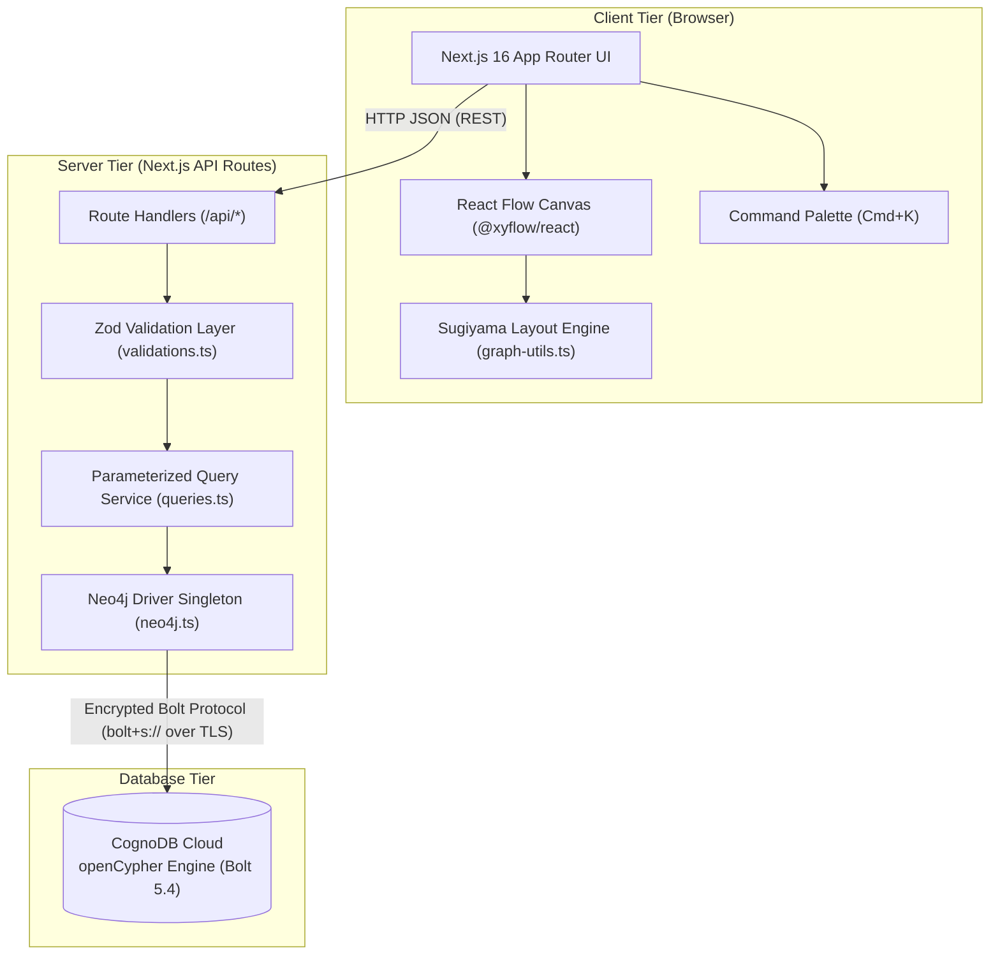
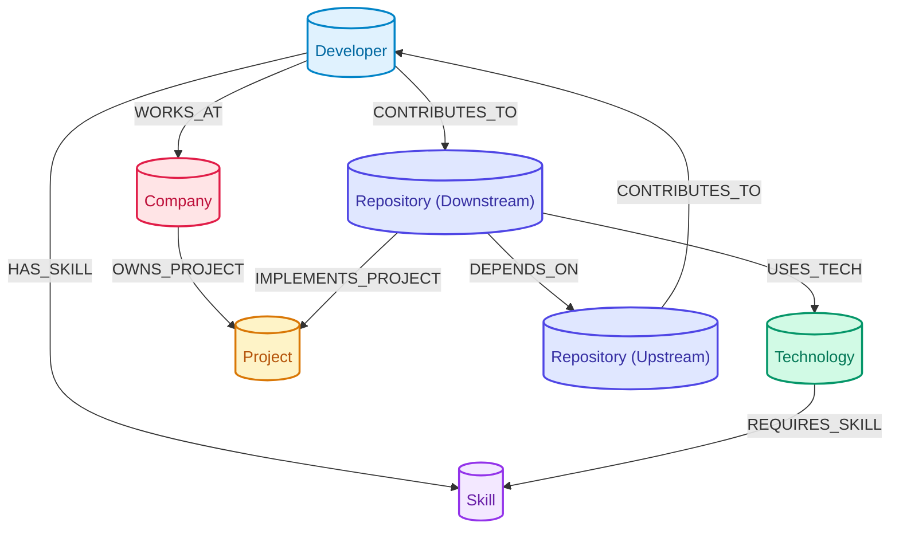

# TechGraph — Engineering Knowledge Explorer

TechGraph is a graph-based engineering knowledge and dependency analysis platform designed to map, query, and visualize relationships across an organization's software ecosystem. It models software engineers, Git repositories, technology stacks, engineering skills, product initiatives, and company structures as an interconnected graph database. By leveraging openCypher pattern matching over graph storage, TechGraph enables instant multi-hop dependency traversal, transitive blast-radius calculation for microservice outages, and on-call incident escalation tracing.

Built with **Next.js 16 (App Router)**, **React 19**, **TypeScript**, **React Flow (`@xyflow/react`)**, **Tailwind CSS**, and **CognoDB Cloud** (openCypher dialect over the Bolt protocol).

---

## 🔗 Project Links

- **GitHub Repository**: [https://github.com/aryan-bhad/wexa_task](https://github.com/aryan-bhad/wexa_task)
- **Live Demo**: *Not currently deployed (Follow the [Getting Started](#-getting-started) instructions to run locally)*
- **Additional Documentation**:
  - [Master Knowledge Audit & Interview Guide](./TECHGRAPH_MASTER_INTERVIEW_GUIDE.md)
  - [Application Testing & Presentation Guide](./TECHGRAPH_TESTING_AND_PRESENTATION_GUIDE.md)

---

## 🎯 Problem

In modern software organizations, engineering infrastructure is fragmented across dozens of microservices, third-party libraries, internal frameworks, and distributed teams. When an incident occurs or a security advisory (e.g., a critical vulnerability in a shared cryptographic or logging library) is published, answering operational questions is challenging:

- **Transitive Impact**: Which downstream microservices and customer-facing products depend directly or indirectly on the affected codebase?
- **Ownership Gaps**: Who are the primary maintainers and active contributors for services multiple hops downstream from a failing dependency?
- **Knowledge Silos**: Which engineers possess verified competency in specific languages, frameworks, or database technologies to assist during an incident?

### The Relational Database Bottleneck
Answering multi-hop dependency questions in a traditional Relational Database Management System (RDBMS) requires modeling relationships via intermediate junction tables (e.g., `developer_skills`, `repository_dependencies`, `project_repositories`). Executing variable-depth traversals across these tables requires nested `INNER JOIN` operations or recursive Common Table Expressions (`WITH RECURSIVE`). As traversal depth increases, recursive SQL queries repeatedly scan join indexes, resulting in complex, hard-to-maintain query logic and escalating execution overhead.

---

## 💡 Solution

TechGraph replaces relational junction tables with a **property graph model**. Rather than treating relationships as foreign keys resolved at query execution time, relationships are stored as first-class directional edges connecting domain entities.

By modeling the ecosystem as a graph:
- **`Developer`** nodes connect to **`Skill`** nodes via `HAS_SKILL` and to **`Repository`** codebases via `CONTRIBUTES_TO`.
- **`Repository`** microservices connect recursively to upstream/downstream services via `DEPENDS_ON` and map to business initiatives via `IMPLEMENTS_PROJECT`.
- **`Technology`** infrastructure nodes link to required competencies via `REQUIRES_SKILL` and to consuming repositories via `USES_TECH`.

This structure allows complex multi-hop queries—such as finding all lead maintainers 3 hops downstream from a failing library—to be expressed concisely in openCypher and traversed directly along connected graph edges.

---

## ✨ Key Features

- **Interactive React Flow Graph Canvas**: Renders nodes and typed relationship edges with custom node cards, semantic category coloring, and interactive zoom/pan/fit controls powered by `@xyflow/react` (React Flow 12).
- **Hierarchical Auto-Layout Engine**: Implements a Sugiyama-style topological layout algorithm (`src/lib/graph-utils.ts`) that automatically computes node ranks (`Company` → `Project` → `Repository` → `Technology`/`Skill` → `Developer`) and applies barycenter horizontal ordering to minimize edge crossings.
- **Transitive Blast-Radius Calculator**: Computes variable-depth downstream dependency impact (`[:DEPENDS_ON*1..6]`) for any repository, organizing affected services by depth level and identifying lead maintainers.
- **Multi-Hop Incident Escalation Explorer**: Traces 3-hop maintainer chains (`Developer -> CONTRIBUTES_TO -> Repository -> DEPENDS_ON*1..3 -> TargetRepository`) to produce actionable on-call escalation directories during outages.
- **Global Command Palette (`⌘K` / `Ctrl+K`)**: Keyboard-driven modal search allowing instant lookup and visual navigation to any developer, repository, skill, project, or technology.
- **Contextual Node Detail Drawer**: Slide-out inspection panel presenting entity properties, live graph relationship badges, and contextual action shortcuts.
- **Interactive Focus & Path Highlighting**: Clicking any node highlights all direct and transitive connection paths with animated edges while dimming unrelated nodes to 40% opacity.
- **Database Connectivity Heartbeat**: Real-time health monitoring badge connected to `/api/health` with diagnostic guidance for connection troubleshooting.
- **Parameterized Cypher Query Layer**: Server-side query service enforcing parameterized openCypher execution to completely prevent Cypher injection.

---

## 🖼️ Screenshots / Product Preview

> [!NOTE]
> Add screenshot captures to `public/screenshots/` using the file names below to display preview assets in this section.

| Preview View | Workflow & Description | Suggested Asset Path |
|---|---|---|
| **Interactive Graph Canvas** | Topological layout with directional relationship pills, canvas toolbar, category filters, and minimap. | `public/screenshots/01-graph-canvas.png` |
| **Node Detail Drawer** | Slide-out attribute inspector showing entity properties, related technologies, and traversal buttons. | `public/screenshots/02-node-inspector.png` |
| **Global Command Palette (`⌘K`)** | Real-time keyboard-first search modal across all entity types. | `public/screenshots/03-command-palette.png` |
| **Blast-Radius Calculator** | Variable-depth downstream dependency breakdown (+1, +2, +3, +4 depth hops). | `public/screenshots/04-blast-radius.png` |
| **Incident Escalation View** | Multi-hop on-call maintainer contact directory for incident response. | `public/screenshots/05-incident-escalation.png` |

---

## 🏗️ Architecture



### Request Flow Overview
1. **Client Interaction**: The user interacts with the React Flow canvas, sidebar category filters, or the `⌘K` command palette.
2. **API Dispatch**: Client components send requests to Next.js Route Handlers in `src/app/api/*`.
3. **Input Validation**: Path and query parameters are validated against strict Zod schemas in `src/lib/validations.ts`.
4. **Query Execution**: Validated parameters are passed into parameterized openCypher query functions in `src/lib/queries.ts`.
5. **Database Driver**: The server-only `neo4j-driver` singleton (`src/lib/neo4j.ts`) manages pooled TLS connections and executes queries against CognoDB Cloud over the Bolt 5.4 protocol.
6. **Data Sanitization & Response**: Query results are sanitized (converting Neo4j Integer representations to JavaScript numbers) and returned via standardized JSON response envelopes (`src/lib/api-response.ts`).

---

## 🧰 Technology Stack

| Layer | Technology | Version | Purpose |
|---|---|---|---|
| **Framework** | Next.js (App Router) | `16.3.1` | React Server Components, client state management, and server-side Route Handlers |
| **UI Library** | React | `19.2.8` | Declarative UI rendering and interactive components |
| **Language** | TypeScript | `^5` | Strict static type definitions across graph schemas, API contracts, and UI props |
| **Styling** | Tailwind CSS | `^4` | Responsive, data-dense styling with CSS custom properties |
| **Graph Canvas** | `@xyflow/react` | `^12.11.3` | Interactive graph canvas, node dragging, viewport controls, and minimap |
| **Database** | CognoDB Cloud | — | Managed graph database executing openCypher dialect over Bolt 5.4 |
| **Database Driver** | `neo4j-driver` | `^6.2.0` | Server-side connection pool management and Bolt session execution |
| **Validation** | Zod | `^4.4.3` | Runtime schema validation for API query strings and route parameters |
| **Icons** | Lucide React | `^1.31.0` | Semantic iconography for entity categories and UI controls |
| **Animations** | Framer Motion | `^13.1.0` | Smooth drawer transitions, tab switching animations, and modal overlays |
| **Security** | `server-only` | `^0.0.1` | Build-time guarantee that database credentials and driver code remain server-side |

---

## 📐 Graph Data Model

The domain ontology models an engineering organization across **6 Node Types** and **8 Typed Relationships**.



### Node Types (6 Labels)

| Node Label | Description | Properties | Category Color |
|---|---|---|---|
| **`Developer`** | Software engineers, maintainers, and technical leads | `id`, `name`, `email`, `role`, `experienceYears` | Sky (`#0284C7`) |
| **`Skill`** | Technical proficiencies and domain capabilities | `id`, `name`, `category`, `description` | Purple (`#9333EA`) |
| **`Technology`** | Languages, frameworks, databases, and infrastructure tools | `id`, `name`, `type`, `ecosystem` | Emerald (`#059669`) |
| **`Project`** | Product initiatives and business platforms | `id`, `name`, `status`, `criticality` | Amber (`#D97706`) |
| **`Repository`** | Git repositories, services, and shared libraries | `id`, `name`, `language`, `url`, `stars` | Indigo (`#4F46E5`) |
| **`Company`** | Parent organization | `id`, `name`, `domain`, `industry` | Rose (`#E11D48`) |

### Relationship Types (8 Edges)

| Relationship Type | Direction | Properties | Description |
|---|---|---|---|
| **`HAS_SKILL`** | `(Developer) → (Skill)` | `proficiency`, `yearsOfExp` | Maps engineer competencies and experience depth |
| **`CONTRIBUTES_TO`** | `(Developer) → (Repository)` | `role`, `commitsCount` | Maps codebase authorship, maintainer roles, and commit activity |
| **`WORKS_AT`** | `(Developer) → (Company)` | `title`, `joinedDate` | Maps organizational membership and job title |
| **`OWNS_PROJECT`** | `(Company) → (Project)` | `department` | Maps company ownership to high-level projects |
| **`IMPLEMENTS_PROJECT`** | `(Repository) → (Project)` | `isPrimary` | Links microservice codebases to strategic projects |
| **`USES_TECH`** | `(Repository) → (Technology)` | `version`, `environment` | Maps technology dependencies and runtime environments |
| **`REQUIRES_SKILL`** | `(Technology) → (Skill)` | `importance` | Maps technical tools to prerequisite engineering skills |
| **`DEPENDS_ON`** | `(Repository) → (Repository)` | `dependencyType`, `criticality` | Recursive dependency chain across microservices |

---

## 📊 Seed Dataset

Populated via `scripts/seed.ts`, the seed dataset represents an active engineering team with **26 Nodes** and **51 Relationships**:

- **1 Company**: `Wexa AI`
- **3 Projects**: `TechGraph Explorer`, `Neural Query Engine`, `Identity & Access Subsystem`
- **6 Repositories**:
  - `techgraph-web` (TypeScript)
  - `graph-query-api` (TypeScript)
  - `cognodb-driver-wrapper` (TypeScript)
  - `auth-core-service` (Go)
  - `crypto-vault-lib` (Go)
  - `common-logging-sdk` (TypeScript)
- **5 Technologies**: `CognoDB Cloud`, `Next.js App Router`, `TypeScript`, `Go`, `PostgreSQL`
- **6 Skills**: `openCypher Querying`, `React Server Components`, `Distributed Systems`, `Cryptography & Security`, `Go Systems Engineering`, `Graph Data Modeling`
- **5 Developers**:
  - `Sarah Chen` (Principal Graph Architect)
  - `Alex Rivera` (Senior Frontend Engineer)
  - `Marcus Vance` (Staff Backend Engineer)
  - `Elena Rostova` (Security & Infrastructure Lead)
  - `David Kim` (Full Stack Engineer)
- **51 Typed Relationships**: 5 `WORKS_AT`, 3 `OWNS_PROJECT`, 6 `IMPLEMENTS_PROJECT`, 9 `CONTRIBUTES_TO`, 9 `HAS_SKILL`, 8 `USES_TECH`, 5 `REQUIRES_SKILL`, 6 `DEPENDS_ON`.

---

## 🔍 Engineering Highlights

### 1. Variable-Depth Transitive Dependency Traversal
Microservice dependencies frequently span multiple hops (e.g., `techgraph-web` → `graph-query-api` → `auth-core-service` → `crypto-vault-lib` → `common-logging-sdk`). TechGraph uses openCypher's variable-length path syntax `-[:DEPENDS_ON*1..6]->` to compute complete downstream dependency chains in a single query without hardcoding fixed join levels.

### 2. Multi-Hop Incident Escalation
When an outage occurs in a foundational utility, finding on-call engineers for all dependent services requires traversing across disparate entity boundaries. TechGraph traverses across three entity types (`Developer` → `CONTRIBUTES_TO` → `Repository` → `DEPENDS_ON*1..3` → `TargetRepository`) in one query to construct an actionable escalation directory.

### 3. Parameterized openCypher Query Layer
All database interactions in `src/lib/queries.ts` use explicit parameter objects passed to `session.run(query, params)`. No user input is concatenated into query strings. This prevents Cypher injection vulnerabilities and allows CognoDB Cloud to cache compiled query execution plans.

### 4. Server-Side Driver & Credential Isolation
The database driver module (`src/lib/neo4j.ts`) imports `"server-only"` to ensure database connection logic, credentials, and connection pools are never bundled into client JavaScript. Client components communicate exclusively through validated Next.js Route Handlers.

### 5. Custom Hierarchical Layout Algorithm
Rather than relying on manual coordinates, `src/lib/graph-utils.ts` implements a layered topological layout algorithm. Nodes are assigned to vertical ranks according to entity hierarchy (`Company: 0` → `Project: 1` → `Repository: 2` → `Technology/Skill: 3` → `Developer: 4`). A barycenter heuristic calculates the average position of connected neighbors to order nodes within each rank, minimizing edge crossings.

### 6. Robust Data Type Sanitization
Neo4j drivers return integers as composite `{ low: number, high: number }` objects to represent 64-bit integers. If passed directly to React components, these objects trigger runtime rendering crashes. `src/lib/neo4j.ts` implements a recursive `sanitizeNeo4jData` utility that safely converts Neo4j Integers into native JavaScript numbers before data reaches the UI layer.

---

## 🔍 Representative openCypher Queries

### Query A: 1-Hop Entity Lookup (Developer Profile)
**Purpose**: Retrieves a developer node and gathers direct 1-hop connections (skills, repositories contributed to, and company).

```cypher
MATCH (dev:Developer {id: $devId})
OPTIONAL MATCH (dev)-[:HAS_SKILL]->(sk:Skill)
OPTIONAL MATCH (dev)-[:CONTRIBUTES_TO]->(repo:Repository)
OPTIONAL MATCH (dev)-[:WORKS_AT]->(comp:Company)
RETURN 
  dev.id AS id,
  dev.name AS name,
  dev.email AS email,
  dev.role AS role,
  dev.experienceYears AS experienceYears,
  collect(DISTINCT sk.name) AS skills,
  collect(DISTINCT repo.name) AS repositories,
  comp.name AS company
```
*Parameter: `{ devId: "dev-1" }`*

---

### Query B: Multi-Hop Incident Escalation (3 Hops)
**Purpose**: Traverses across developer contributions and multi-hop repository dependencies to identify maintainers affected by an upstream library failure.

```cypher
MATCH (dev:Developer)-[c:CONTRIBUTES_TO]->(depRepo:Repository)-[d:DEPENDS_ON*1..3]->(target:Repository {id: $targetRepoId})
RETURN DISTINCT
  dev.name AS developerName,
  dev.email AS email,
  c.role AS role,
  depRepo.name AS dependentRepo,
  target.name AS targetRepo,
  1 AS hopDistance
```
*Parameter: `{ targetRepoId: "repo-5" }`*

---

### Query C: Variable-Length Transitive Blast Radius (1–6 Hops)
**Purpose**: Calculates the complete downstream impact tree when a repository fails and retrieves the lead maintainer for each affected codebase.

```cypher
MATCH path = (downstream:Repository)-[:DEPENDS_ON*1..6]->(target:Repository {id: $repoId})
OPTIONAL MATCH (m:Developer)-[:CONTRIBUTES_TO {role: 'Lead Maintainer'}]->(downstream)
RETURN 
  downstream.id AS affectedRepoId,
  downstream.name AS affectedRepoName,
  downstream.language AS language,
  length(path) AS depth,
  m.name AS leadMaintainer,
  m.email AS contactEmail
ORDER BY depth ASC
```
*Parameter: `{ repoId: "repo-6" }`*

---

## 🔌 API Reference

All endpoints are implemented as Next.js Route Handlers in `src/app/api/` with parameter validation via Zod schemas (`src/lib/validations.ts`).

| Endpoint | Method | Parameters | Purpose |
|---|---|---|---|
| `/api/health` | `GET` | None | Verifies CognoDB Cloud connectivity over Bolt; returns `200` (online) or `503` (unreachable). |
| `/api/graph` | `GET` | `labelFilter` *(optional)*, `searchQuery` *(optional)* | Returns nodes and edges formatted for React Flow canvas rendering. |
| `/api/blast-radius` | `GET` | `repoId` *(optional, default: `repo-6`)* | Computes variable-depth downstream dependency impact (Query C). |
| `/api/incidents` | `GET` | `targetRepoId` *(optional, default: `repo-5`)* | Returns 3-hop maintainer escalation chains (Query B) for an affected codebase. |
| `/api/developers/[id]` | `GET` | `id` *(path param, e.g. `dev-1`)* | Returns full profile, skills, repositories, and company for a developer. |
| `/api/technologies/[id]` | `GET` | `id` *(path param, e.g. `tech-1`)* | Returns technology ecosystem details, consuming repositories, and skilled developers. |
| `/api/projects/[id]` | `GET` | `id` *(path param, e.g. `proj-1`)* | Returns project metadata, implementing repositories, team members, and tech stack. |

---

## 🔐 Security & Data Handling

- **Parameterized Execution**: Every openCypher query uses strict parameter binding to eliminate Cypher injection risks.
- **Server-Only Driver**: Database connection pooling and query execution logic are restricted to the server via the `server-only` package.
- **Credential Segregation**: Database connection parameters (`NEO4J_URI`, `NEO4J_USER`, `NEO4J_PASSWORD`) are loaded exclusively from server environment variables (`.env.local`), which is excluded from Git via `.gitignore`.
- **Validation Boundaries**: All incoming path and query parameters are parsed and sanitized through Zod schemas before being passed to query functions.

> [!NOTE]
> This project is designed for engineering knowledge exploration and does not include user authentication or role-based authorization (RBAC).

---

## 🚀 Getting Started

### Prerequisites

- **Node.js**: `v18.18.0` or higher (Node.js 20+ recommended)
- **npm**: `v9.0.0` or higher
- **CognoDB Cloud Instance**: Provision a free instance at [CognoDB Cloud Console](https://console.cognodb.com/signup) (or any Neo4j-compatible instance supporting Bolt 5.0+).

### 1. Clone the Repository

```bash
git clone https://github.com/aryan-bhad/wexa_task.git
cd wexa_task
```

### 2. Install Dependencies

```bash
npm install
```

### 3. Configure Environment Variables

Create `.env.local` by copying `.env.example`:

```bash
cp .env.example .env.local
```

Edit `.env.local` with your CognoDB Cloud instance details:

```env
# CognoDB Cloud Database Connection Secrets
NEO4J_URI=bolt+s://<your-instance-id>.databases.cognodb.cloud:7687
NEO4J_USER=cognodb
NEO4J_PASSWORD=<your-generated-cognodb-password>
```

> [!WARNING]
> Never commit `.env.local` or database credentials to version control.

### 4. Verify Database Connection

Run the diagnostic script to test your TLS Bolt connection and measure latency:

```bash
npm run test:db
```

### 5. Seed the Database

Create uniqueness constraints and populate the 26 nodes and 51 relationships:

```bash
npm run seed
```

### 6. Verify Cypher Query Suite (Optional)

Run the query verification script to execute Queries A, B, and C in the terminal:

```bash
npm run test:queries
```

### 7. Start Development Server

```bash
npm run dev
```

Open [http://localhost:3000](http://localhost:3000) in your browser.

---

## 📜 Available Scripts

| Command | Purpose |
|---|---|
| `npm run dev` | Starts the Next.js development server on `http://localhost:3000` |
| `npm run build` | Compiles an optimized Next.js production build |
| `npm run start` | Runs the compiled production server |
| `npm run lint` | Executes ESLint checks across the codebase |
| `npm run test:db` | Tests connection and measures latency to CognoDB Cloud over Bolt |
| `npm run seed` | Seeds database with schema constraints, nodes, and relationships |
| `npm run test:queries` | Runs terminal tests for Query A, Query B, and Query C |

---

## 📁 Project Structure

```text
wexa_task/
├── .env.example                   # Environment variable template
├── .env.local                     # Local database credentials (git-ignored)
├── README.md                      # Primary project documentation
├── package.json                   # Project dependencies and npm scripts
├── tsconfig.json                  # TypeScript configuration
├── next.config.ts                 # Next.js configuration
├── scripts/
│   ├── seed.ts                    # CognoDB seed loader with constraints and UNWIND batches
│   ├── test-db-connection.ts      # Standalone database connectivity diagnostic script
│   └── test-queries.ts            # Terminal verification for Queries A, B, and C
└── src/
    ├── app/
    │   ├── api/                   # Next.js Server Route Handlers (Zod-validated)
    │   │   ├── blast-radius/      # Query C: Downstream blast-radius endpoint
    │   │   ├── developers/[id]/   # Query A: Developer profile endpoint
    │   │   ├── graph/             # Graph visualizer topology endpoint
    │   │   ├── health/            # CognoDB connection heartbeat endpoint
    │   │   ├── incidents/         # Query B: 3-hop maintainer escalation endpoint
    │   │   ├── projects/[id]/     # Project team matrix endpoint
    │   │   └── technologies/[id]/ # Technology ecosystem endpoint
    │   ├── globals.css            # Tailwind CSS styling and theme custom properties
    │   ├── layout.tsx             # Root layout wrapper with fonts and metadata
    │   └── page.tsx               # Main dashboard with graph, blast-radius, and incident views
    ├── components/
    │   ├── graph/
    │   │   ├── CustomNode.tsx     # React Flow custom node with category icons and badges
    │   │   ├── GraphCanvas.tsx    # React Flow canvas wrapper, controls, and presentation mode
    │   │   └── NodeDetailDrawer.tsx # Slide-out node attribute inspector with traversal shortcuts
    │   ├── layout/
    │   │   ├── AppShell.tsx       # Motion-wrapped layout shell with tab state management
    │   │   ├── Header.tsx         # Header with navigation tabs, search trigger, and health badge
    │   │   └── Sidebar.tsx        # Category filtering sidebar and entity count badges
    │   ├── search/
    │   │   └── CommandPalette.tsx # Global Cmd+K / Ctrl+K keyboard search modal
    │   └── ui/
    │       ├── Badge.tsx          # Status and entity category badge components
    │       ├── Button.tsx         # Accessible UI button component
    │       ├── Card.tsx           # Clean surface card container
    │       ├── DatabaseErrorBanner.tsx # Offline database warning banner
    │       ├── EntityDistributionChart.tsx # Graph entity breakdown chart
    │       ├── ErrorBoundary.tsx  # React error boundary component
    │       └── Skeleton.tsx       # Loading skeleton component
    ├── lib/
    │   ├── api-response.ts        # Standardized JSON response and error handlers
    │   ├── graph-utils.ts         # Sugiyama-style topological layout generator
    │   ├── neo4j.ts               # Server-only Neo4j driver singleton and sanitizer
    │   ├── queries.ts             # Parameterized openCypher query service functions
    │   ├── utils.ts               # Tailwind class merger utility (`cn`)
    │   └── validations.ts         # Zod schemas for query and path parameters
    └── types/
        └── index.ts               # TypeScript interfaces for nodes, edges, and domain models
```

---

## 🧪 Verification & Quality

| Verification Check | Command | Result | Notes |
|---|---|---|---|
| **TypeScript Typecheck** | `npx tsc --noEmit` | Passed | 0 type errors across strict TypeScript compiler configuration |
| **ESLint Code Quality** | `npm run lint` | Passed | 0 errors, 0 warnings across Next.js and React rules |
| **Next.js Production Build** | `npm run build` | Passed | Static pages and dynamic Route Handlers compiled successfully |
| **Database Connection** | `npm run test:db` | Verified | Connects over TLS Bolt protocol with latency reporting |
| **Cypher Query Test Suite** | `npm run test:queries` | Verified | Query A, Query B, and Query C verified against CognoDB Cloud |
| **Automated Browser E2E** | — | Not Configured | Automated browser E2E testing (Playwright/Cypress) is not currently configured |

---

## ⚠️ Known Limitations

- **Curated Demonstration Dataset**: The included dataset contains 26 nodes and 51 relationships designed to illustrate core relationship patterns. Large-scale enterprise datasets would require pagination or clustering strategies.
- **Read-Heavy Exploration**: The application is focused on visualization, dependency querying, and incident escalation. Interactive in-canvas node creation and mutation are not currently implemented.
- **Authentication**: Access control, user login, and role-based permissions (RBAC) are not included in this evaluation version.
- **No Automated E2E Browser Tests**: Automated testing currently covers static typing, linting, build compilation, and database integration; end-to-end browser automation tests are not yet implemented.

---

## 🔮 Future Improvements

- **In-Canvas Graph Mutations**: Adding interactive forms to create, edit, and link nodes directly from the graph canvas with Cypher mutation endpoints.
- **Automated Git Ingestion**: Ingesting GitHub/GitLab webhooks to automatically synchronize repository dependencies, contributors, and commit activity in real time.
- **Authentication & RBAC**: Implementing role-based access control (e.g., Viewer vs. Architect).
- **Data Export & Reporting**: Exporting subgraphs and blast-radius summaries to JSON, CSV, or vector SVG formats.
- **Subgraph Virtualization & Clustering**: Implementing dynamic node clustering for visualizing graphs with thousands of nodes.

---

## 📚 Additional Documentation

- [Master Knowledge Audit & Interview Guide](./TECHGRAPH_MASTER_INTERVIEW_GUIDE.md) — Comprehensive technical reference covering project architecture, openCypher queries, presentation scripts, and interview Q&A.
- [Application Testing & Presentation Guide](./TECHGRAPH_TESTING_AND_PRESENTATION_GUIDE.md) — Step-by-step testing workflows and feature demonstration guide.

---

## 📄 License

This project is a private engineering evaluation submission and technical demonstration. All rights reserved.

---

## 👤 Author

**Aryan Bhad**

- GitHub: [@aryan-bhad](https://github.com/aryan-bhad)
- Repository: [https://github.com/aryan-bhad/wexa_task](https://github.com/aryan-bhad/wexa_task)
